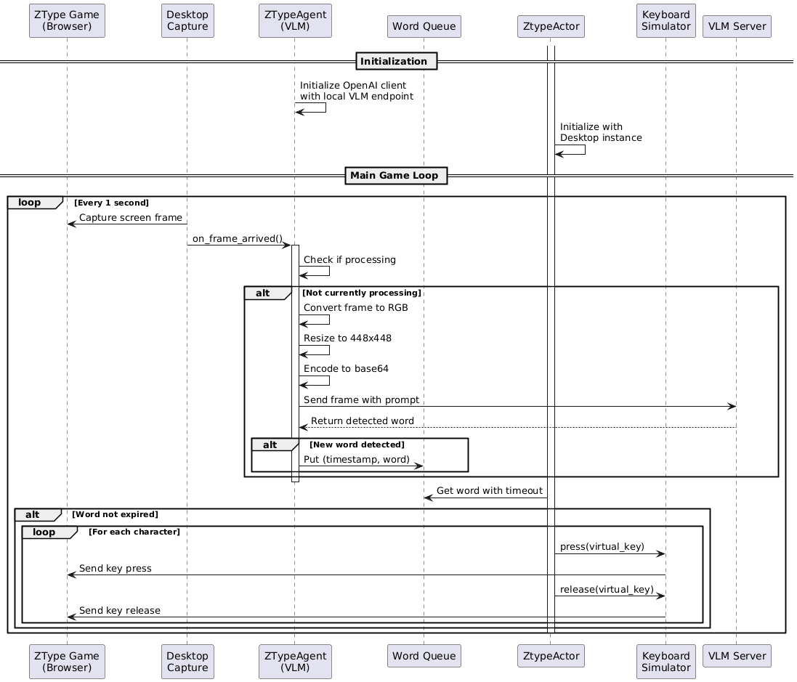

# ZType Game Agent with Vision Language Model

An AI agent that plays [ZType](https://zty.pe/) - a typing game where you shoot down enemies by typing words. The agent uses [InternVL2.5-1B](https://huggingface.co/OpenGVLab/InternVL2_5-1B) Vision Language Model to detect words and simulates keyboard inputs to play the game.

## Key Features

- Real-time, (1B VLM)
- on-device, (RTX 4070 laptop)
- train-free, (no fine-tuning)
- interactive game agent! (ztype)

## How It Works

1. **Screen Capture**: Continuously captures frames from the ZType game window
2. **Word Detection**: Uses InternVL2 VLM to identify the lowest word on screen
3. **Keyboard Simulation**: Types detected words using virtual keyboard inputs

## Key Components

### Vision Language Model (InternVL2)

```python
def setup_desktop_env(self):
args = DesktopArgs(
    windows_capture_args={
        "on_frame_arrived": self.on_frame_arrived,
        "pipeline_description": construct_pipeline(
            window_name="ztype",
            framerate="1/1",
        ),
    }
)
```

- Captures game window frames
- Configurable framerate to balance performance
- Queues frames for processing

### Keyboard Control

```python
def type_word(self, word: str):
for char in word.lower():
    if char in self.char_to_vk:
        vk = self.char_to_vk[char]
        self.keyboard.press(vk)
        time.sleep(0.05)
        self.keyboard.release(vk)
```

- Maps characters to Windows virtual key codes
- Simulates natural typing with delays
- Handles keyboard press/release events

## Usage

### Docker (Recommended)

WSL + Docker + lmdeploy openai compatible server

1. Install desktop-env
2. Build InternVL_Dockerfile

```bash
docker build -t internvl-custom:latest -f InternVL_Dockerfile .
```

3. .env config & docker-compose
   - Copy `env.example` to `.env`
     ```bash
     cp .env.example .env
     ```
   - Edit `.env` and add your HF token:
     ```env
     HUGGING_FACE_HUB_TOKEN=your_actual_token_here
     ```
4. Now docker up

```bash
docker-compose up
```

5. Then enjoy python!

```bash
python ztype_agent_wsl_docker.py
```

### Native Windows

Pure windows installation guide (without WSL).
No dockerized setup.

1. Install dependencies:

```bash
conda create -n owa python=3.11 -y
conda activate owa

conda install pytorch==2.4.0 torchvision==0.19.0 torchaudio==2.4.0 pytorch-cuda=12.4 -c pytorch -c nvidia
pip install packaging ninja
pip install flash-attn --no-build-isolation
pip install lmdeploy
```

The agent will:

- Start capturing the game window
- Detect and type words for 150 seconds
- Automatically clean up and exit

```bash
python ztype_agent.py
```

## Implementation Details

### Frame Processing

- Uses queue system to handle frame processing
- Skips frames if processing is behind
- Converts BGRA frames to RGB for VLM

### Word Detection

- Custom VLM prompt for consistent word detection
- Focuses on lowest word for better game strategy
- Includes error handling for VLM responses

### Keyboard Input

- Uses Windows virtual key codes for reliable input
- Implements natural typing delays
- Handles lowercase character mapping

## Requirements

- Windows OS
- Python 3.11+
- Browser with ZType game open
- GPU recommended for VLM performance (tested on rtx 4070 laptop)

## System Architecture

### Sequence Diagram



The sequence diagram above illustrates the interaction between different components:

1. **Initialization Phase**

   - ZTypeAgent initializes OpenAI client with local VLM endpoint
   - ZtypeActor initializes with Desktop instance

2. **Main Game Loop**

   - Desktop Capture takes screenshots every 1 second
   - Agent processes frames through VLM
   - Detected words are queued for typing
   - Actor types words using keyboard simulation

3. **Key Interactions**
   - Frame processing with duplicate prevention
   - Word expiration checking
   - Natural typing simulation with key press/release events
